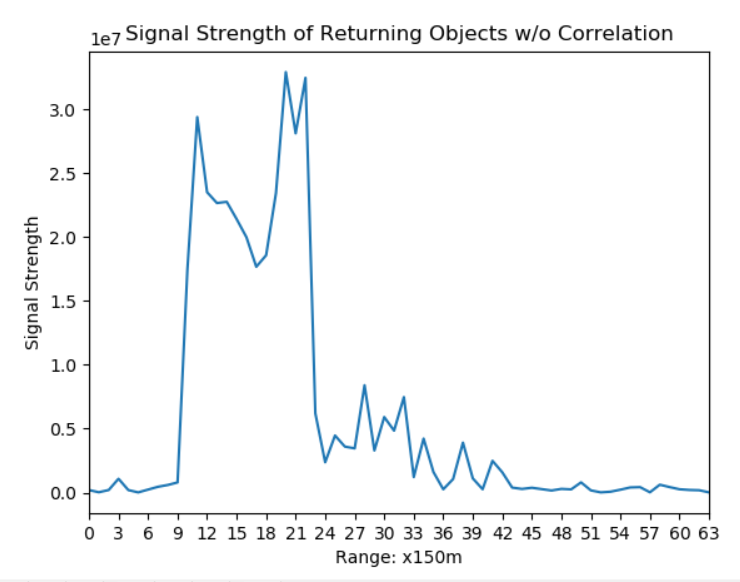

# BarkerCode
Barker Code Cross Correlation Analysis

## Intro

This repo uses Numpy to calculate auto-correlation results of [Barker Codes] (https://en.wikipedia.org/wiki/Barker_code)

Two example Barker Sequences (7 and 13) are generated with each specific sequence lasting for 1 micro-second and plotted using Numpy and can be seen below:

## Barker Sequences

Each micro-second contains ten data points for better accuracy and precision.

When autocorrelated, the Barker Sequences produces a peak pulse with minimum sidelobes.

## Auto-Correlation of Barker Sequences

## Application

Barker Pulses can be used in radar detection and ranging to improve range resolution. For example, taking a sample radar return signal from a 13-Length Barker pulse and plotting its return energy shows:

From the graph, it is diffcult to where or how many targets have been detected. Auto-correlating with the known Barker template shows the following:

From the graph, 3 clear targets were detected in the return signal.
